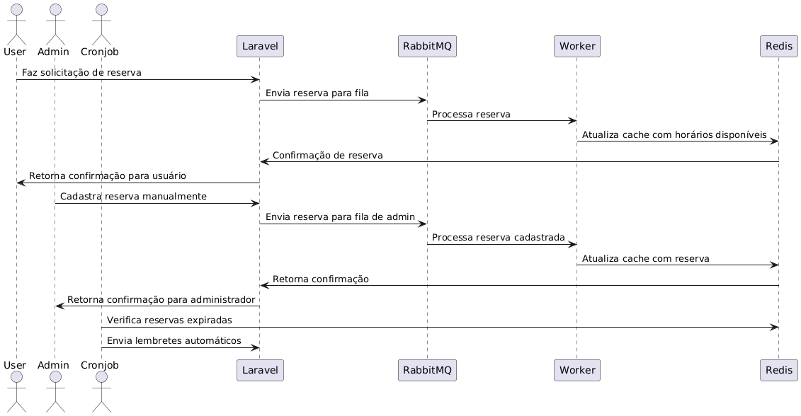

## Reservation System
Overview

This diagram illustrates the flow of a reservation request in our system, from the user to the database update and notification sending. We use an asynchronous architecture with queues (RabbitMQ) to process reservations efficiently.
How to Run the Project

 
### Deploy

docker-compose up -d

## Run migrations

php artisan migrate

## Coverage
    Access test coverage: Open your browser and go to http://localhost:4000/coverage to view test results.

### Architecture Details

    User: Makes a reservation request.
    Laravel: Receives the request and sends it to the RabbitMQ queue.
    RabbitMQ: Stores tasks to be processed.
    Worker: Consumes tasks from the queue, processes the reservation, and updates the database.
    Redis: Stores data in cache for better performance.

### Benefits of the Architecture

    Asynchronous processing: Allows the system to respond quickly to the user.
    Scalability: Makes it easy to add more resources to meet demand.
    Decoupling: Allows different parts of the system to be developed and maintained independently.

### Next Steps

    Detailed documentation: Create a complete documentation of the system implementation.
    Testing: Expand test coverage to ensure code quality.
    Performance improvements: Optimize the system for better performance.